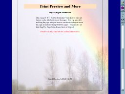



## Print\-Preview and More

### Description

Bug Fix: 4-19-04 This code gives you the ability to add print previewing to you application and the tools to allow you to make nice looking printed reports. You can fix the printing options such as paper orientation and preview/screen or allow the user to change them when running the report. Use it to design reports without wasting all that paper. I have tried to make this as simple as possible so you can add it to your existing projects and with only a little effort to change your reports. I have never before asked for votes, but I have put a lot of time into this and would appreciate your feedback (please be kind).
 
### More Info
 

             |
---                |---
**Submitted On**   |2004-04-19 07:51:20
**By**             |[Morgan Haueisen](https://github.com/Planet-Source-Code/PSCIndex/blob/master/ByAuthor/morgan-haueisen.md)
**Level**          |Advanced
**User Rating**    |4.9 (749 globes from 154 users)
**Compatibility**  |VB 5\.0, VB 6\.0
**Category**       |[VB function enhancement](https://github.com/Planet-Source-Code/PSCIndex/blob/master/ByCategory/vb-function-enhancement__1-25.md)
**World**          |[Visual Basic](https://github.com/Planet-Source-Code/PSCIndex/blob/master/ByWorld/visual-basic.md)
**Archive File**   |[Print\-Prev1735384192004\.zip](https://github.com/Planet-Source-Code/morgan-haueisen-print-preview-and-more__1-37488/archive/master.zip)

